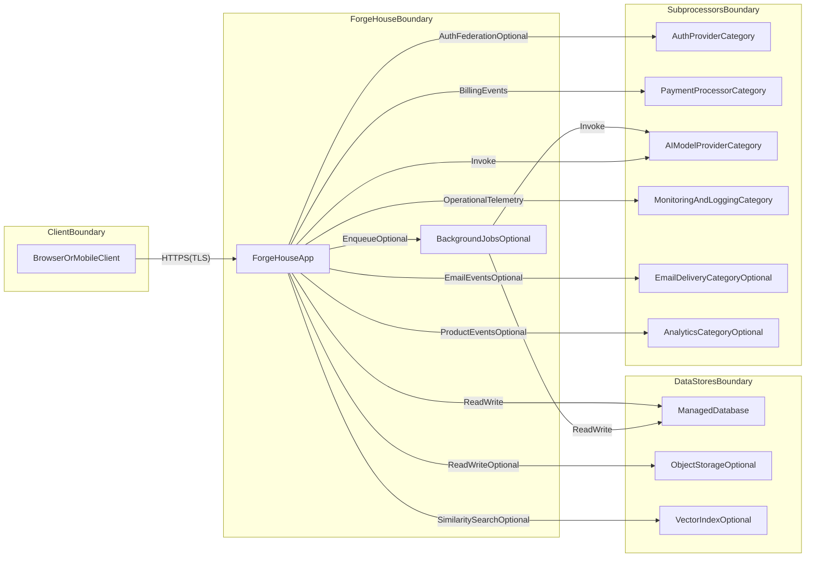

# ForgeHouse Security

*Security overview for customers, partners, and vendor risk/security reviews.*

| Field | Value |
|---|---|
| Document | ForgeHouse Security Overview |
| Version | 1.1 |
| Last updated | April 9, 2026 |
| Audience | Customers, partners, and security reviewers evaluating ForgeHouse |
| Contact (security) | leon@forgehouse.io (subject: “Security”) |
| Related docs | [Privacy Policy](https://forgehouse.io/privacy) |

This document describes how ForgeHouse approaches security and data protection for the ForgeHouse platform (web application, mentor agents, expert onboarding, and related APIs). It is intended to be useful for vendor security reviews and common security questionnaires.

This overview does not replace our Privacy Policy or your agreement with us. Where this document and our Privacy Policy overlap, the Privacy Policy is the authoritative description of privacy practices and disclosures.

---

## At a glance

- **Encryption in transit**: HTTPS/TLS is used for user-to-ForgeHouse traffic and for ForgeHouse-to-subprocessor traffic where supported.
- **Server-side access control**: Authorization checks for customer data access are enforced on the server (not only in the client).
- **Mentor knowledge isolation**: Expert-provided knowledge is logically scoped to the relevant mentor experience and is not intended to be used across mentors.
- **Payments**: Payments are processed by a dedicated payment processor; ForgeHouse does not store full payment card numbers.
- **AI**: ForgeHouse uses AI providers to deliver mentor-agent functionality. Our Privacy Policy states we do not use your conversations to train AI models.

---

## Table of contents

1. [Purpose, scope, and shared responsibility](#1-purpose-scope-and-shared-responsibility)
2. [Definitions and system components](#2-definitions-and-system-components)
3. [Architecture and trust boundaries](#3-architecture-and-trust-boundaries)
4. [Data categories and lifecycle (collection → processing → storage → deletion)](#4-data-categories-and-lifecycle-collection-processing-storage-deletion)
5. [Identity and access management](#5-identity-and-access-management)
6. [Application security and secure development practices](#6-application-security-and-secure-development-practices)
7. [Data protection (in transit, at rest, secrets)](#7-data-protection-in-transit-at-rest-secrets)
8. [AI security considerations](#8-ai-security-considerations)
9. [Logging, monitoring, and auditability](#9-logging-monitoring-and-auditability)
10. [Vulnerability management and responsible disclosure](#10-vulnerability-management-and-responsible-disclosure)
11. [Incident response and business continuity](#11-incident-response-and-business-continuity)
12. [Third-party processing and subprocessors (by category)](#12-third-party-processing-and-subprocessors-by-category)
13. [Compliance posture and available artifacts](#13-compliance-posture-and-available-artifacts)
14. [Security roadmap (clearly labeled)](#14-security-roadmap-clearly-labeled)
15. [Changes and contact](#15-changes-and-contact)

---

## 1. Purpose, scope, and shared responsibility

### 1.1 Purpose

ForgeHouse provides an AI-enabled mentoring experience. Security is designed to protect:

- **Customer data** (conversations, account details, and related content)
- **Mentor intellectual property** (expert onboarding inputs and derived representations)
- **Platform integrity and availability**

### 1.2 Scope

**In scope** (non-exhaustive):

- Account access and session handling
- Conversation and insight storage
- Mentor onboarding inputs and knowledge retrieval
- Subscription/billing metadata stored by ForgeHouse
- Operational controls needed to run the service

**Out of scope**:

- Security of customer devices and networks
- Security of third-party services beyond what they provide as subprocessors (see §12)

### 1.3 Shared responsibility

- **ForgeHouse responsibilities**: operate the application, enforce authorization, manage secrets and configuration, maintain operational monitoring, and coordinate incident response.
- **Customer responsibilities**: protect account credentials and any issued API secrets, maintain device/browser patching, and evaluate whether ForgeHouse meets their internal requirements for the sensitivity of data they choose to share.

---

## 2. Definitions and system components

This document uses the following terms:

- **Customer**: an end user or organization using ForgeHouse.
- **Mentor**: an expert whose knowledge is used to power a mentor experience.
- **Mentor knowledge**: mentor-provided content and derived representations used to answer questions in that mentor’s experience.
- **Embedding**: a numerical vector derived from content to support retrieval and ranking.
- **Subprocessor**: a third party that processes data on ForgeHouse’s behalf (hosting, database, authentication infrastructure, AI, payments, email, analytics, etc.).
- **Operational telemetry**: logs, traces, metrics, and security signals used to operate the service.

---

## 3. Architecture and trust boundaries

The diagram below is illustrative. It is intended to show trust boundaries and major data flows without naming vendors.

**Trust boundary intent**:

- `ClientBoundary`: customer-controlled environment (browser/device).
- `ForgeHouseBoundary`: ForgeHouse application logic and server-side enforcement.
- `DataStoresBoundary`: persistent storage used by ForgeHouse.
- `SubprocessorsBoundary`: third parties used to provide hosting, auth, payments, AI, and operational tooling.

---

## 4. Data categories and lifecycle

This section describes what data we handle and how it flows through the system. The Privacy Policy is the authoritative source for retention details and disclosures.

### 4.1 Data categories (summary)

| DataCategory | Examples | PrimaryUse | SharedWithSubprocessors |
|---|---|---|---|
| AccountAndProfile | Email, name, avatar (depends on sign-in method) | Authentication, account management | Hosting and database categories; auth category where used |
| ConversationsAndInsights | Messages, outputs, saved insights | Provide mentor experience and user features | AI category as needed; hosting and database categories |
| MentorKnowledge | Expert onboarding content, derived representations | Power a specific mentor experience | AI category as needed; vector index category if used |
| Embeddings | Numerical vectors derived from content | Retrieval and ranking | Vector index category if used |
| BillingMetadata | Subscription status and billing metadata | Subscription enforcement and billing support | Payment processor category |
| OperationalTelemetry | Errors, abuse signals, security events | Reliability and security monitoring | Monitoring/logging category |

### 4.2 Data lifecycle: collection → processing → storage → deletion

ForgeHouse aims to minimize data collection to what is required to operate the service and deliver the product.

- **Processing**: content may be processed by AI providers to generate responses. Only the minimum content required for the specific request is intended to be sent.
- **Storage**: persistent data is stored in managed storage systems; encryption-at-rest and physical security are provided by the hosting and storage providers.
- **Deletion**: deletion and retention are governed by product behavior and the Privacy Policy. Some data may persist temporarily in backups or logs depending on system design and provider capabilities.

### 4.3 What ForgeHouse does not store

- **Full payment card numbers** are not stored by ForgeHouse. Payment processing is delegated to the payment processor category.

---

## 5. Identity and access management

### 5.1 End-user authentication

- **Sign-in**: ForgeHouse supports industry-standard sign-in methods (for example OAuth-based federated sign-in and/or email-based verification depending on configuration).
- **Session security**: session lifetime, rotation, and cookie settings follow the authentication infrastructure configuration.

### 5.2 Authorization and tenancy

- **Server-side authorization**: access to customer data and account actions is enforced on the server.
- **Subscription enforcement**: paid capabilities are enforced server-side in line with subscription status.

### 5.3 Administrative access (internal)

ForgeHouse intends to apply least-privilege to internal access to production systems and customer data. Where deeper information is required for enterprise diligence, additional details and evidence may be shared under NDA.

---

## 6. Application security and secure development practices

ForgeHouse aims to reduce common application-layer risks by applying practices such as:

- **Change review**: review of changes that affect authentication, authorization, data handling, or payment flows.
- **Dependency hygiene**: relying on maintained frameworks and dependencies; updating dependencies to address known vulnerabilities.
- **Secrets management**: secrets are supplied through deployment configuration and are not intended to be embedded in client-side code.

This overview does not enumerate a full SDLC control catalog. Where required for enterprise diligence, we may provide additional detail under NDA.

---

## 7. Data protection (in transit, at rest, secrets)

### 7.1 Data in transit

- Traffic between users and ForgeHouse is protected using **HTTPS/TLS**.
- Traffic between ForgeHouse and major subprocessors is protected using **TLS** where supported.

### 7.2 Data at rest

- ForgeHouse relies on managed hosting, database, and storage providers for encryption-at-rest and physical security controls.
- This document does not describe internal key hierarchies or provider-specific storage layouts.

### 7.3 Secrets

- API keys, database credentials, and similar values are not intended to be embedded in client-side code.
- Secrets are supplied through deployment configuration and access is restricted to systems that require them.

---

## 8. AI security considerations

AI-enabled systems introduce additional risks beyond traditional SaaS controls. This section summarizes design intent and common mitigations ForgeHouse aims to apply.

### 8.1 Data minimization for model calls

When invoking AI providers, ForgeHouse intends to:

- Send only the minimum prompt/context required for the requested operation.
- Avoid including secrets (API keys, credentials) in model prompts.

### 8.2 Mentor knowledge isolation and cross-tenant risk

ForgeHouse’s mentor knowledge is intended to be logically scoped to the relevant mentor experience. In practical terms, this means:

- Knowledge retrieval for a mentor experience is intended to be constrained to that mentor’s stored knowledge and derived representations.
- Server-side enforcement is used to prevent mixing mentor knowledge across experiences in normal operation.

### 8.3 Prompt injection and tool misuse

ForgeHouse expects and designs for the possibility that users may attempt to coerce the system into unintended behavior (for example requesting secrets, or attempting to access data they do not own). Where the product offers tool-like operations, ForgeHouse aims to reduce risk through techniques such as:

- Server-side authorization on every tool/action that touches customer data.
- Allowlisting and structured input validation for tool requests where applicable.
- Rate limiting and abuse controls appropriate to the endpoint.

### 8.4 Provider training and retention

Our Privacy Policy states that we do not use customer conversations to train AI models. Provider-side retention of API payloads is governed by provider policies and applicable commercial terms.

---

## 9. Logging, monitoring, and auditability

ForgeHouse maintains operational telemetry appropriate to running a web application, for example:

- **Availability and error monitoring** (service errors, crash reporting)
- **Security signals** (abuse patterns, suspicious auth activity where available)
- **Operational logs** supporting incident response and debugging

This overview does not publish log schemas or precise retention periods. Where required for enterprise reviews, details may be provided under NDA.

---

## 10. Vulnerability management and responsible disclosure

- **Reporting**: report suspected vulnerabilities to **leon@forgehouse.io** with “Security” in the subject.
- **Triage**: reported issues are assessed for severity, reproduced or validated where possible, and remediated based on risk.
- **Coordination**: where a subprocessor is implicated, ForgeHouse coordinates with the relevant vendor as appropriate.

---

## 11. Incident response and business continuity

### 11.1 Incident response lifecycle

ForgeHouse’s incident response process generally follows:

1. Detect and validate
2. Triage and scope
3. Contain
4. Eradicate and remediate
5. Recover and verify
6. Document and improve (post-incident review)

### 11.2 Notification

Where we determine that applicable law or contract requires customer notification, we will follow those obligations. This document does not create notification duties beyond your agreement and applicable law.

---

## 12. Third-party processing and subprocessors (by category)

ForgeHouse uses subprocessors for common SaaS functions. The authoritative list is maintained alongside the Privacy Policy, and is updated when subprocessors are added or materially changed.

Typical categories include:

- **Hosting and compute**
- **Database and storage**
- **Authentication infrastructure**
- **Payments**
- **AI model and related services**
- **Email delivery** (optional depending on features)
- **Monitoring/logging**
- **Analytics** (optional depending on configuration)

Data shared with subprocessors is intended to be limited to what is required for each function (for example account identifiers, content required for AI calls, payment metadata, operational telemetry).

---

## 13. Compliance posture and available artifacts

### 13.1 Compliance posture

ForgeHouse designs and operates the service with practices common to modern B2B SaaS (access control, encryption in transit, vendor diligence). ForgeHouse does not claim certifications (for example SOC 2 Type II) in this document unless and until we publish them separately.

### 13.2 Available artifacts (may be shared under NDA)

Depending on the engagement, ForgeHouse may be able to provide documents such as:

- Updated architecture diagrams and data flow descriptions
- Policies and plans (for example incident response plan)
- Subprocessor and data-flow summaries aligned to customer questionnaires

---

## 14. Security roadmap (clearly labeled)

This section describes goals and intended improvements. Roadmap items are not commitments and may change.

Potential roadmap themes include:

- More detailed customer-facing retention and deletion disclosures aligned across product behavior and documentation
- Expanded auditability and administrative access documentation for enterprise reviews
- Additional AI safety and security controls for prompt injection and tool misuse, as the product evolves

---

## 15. Changes and contact

### 15.1 Changes

We may update this overview to reflect product or legal changes. The **Last updated** date at the top will change when we do. Material reductions in protection will be communicated as required by law or contract.

### 15.2 Contact

- **Security**: leon@forgehouse.io (subject: “Security”)  
- **Privacy**: See [Privacy Policy](https://forgehouse.io/privacy)
